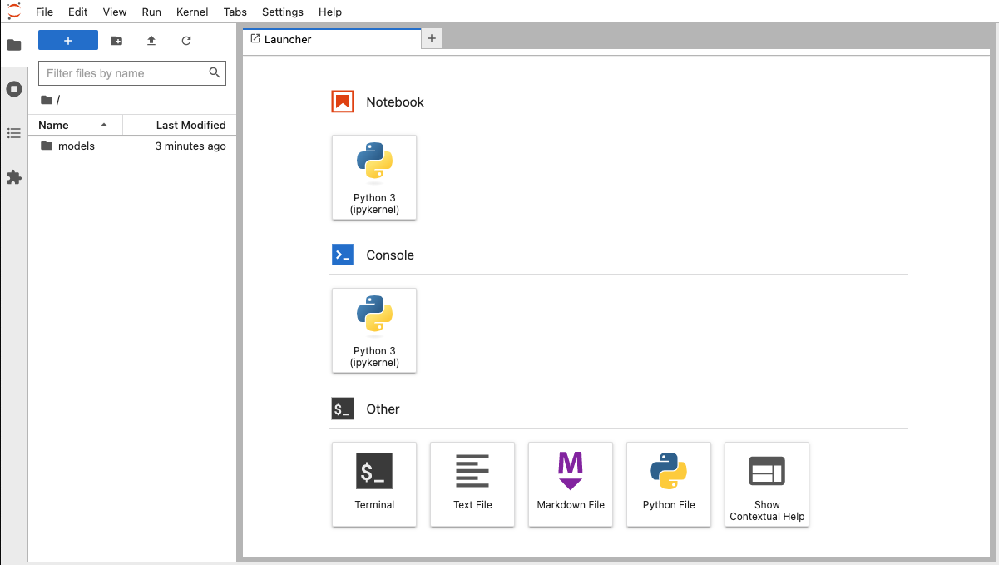
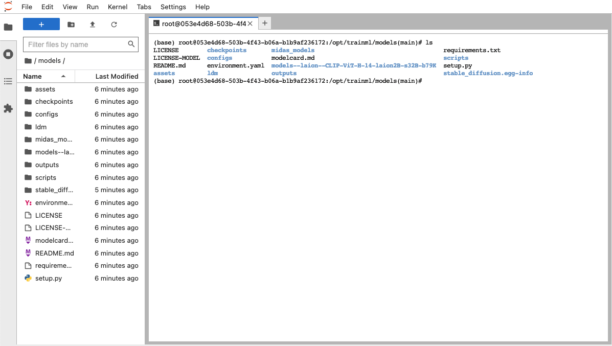
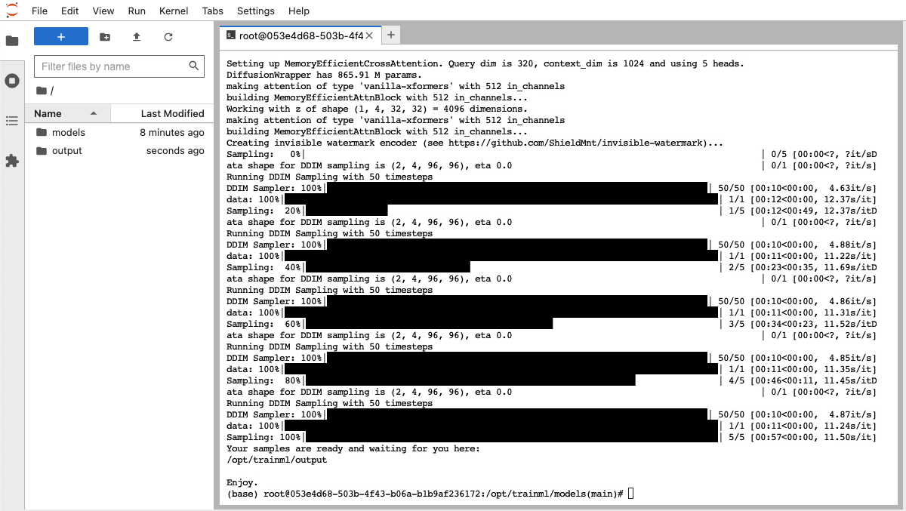
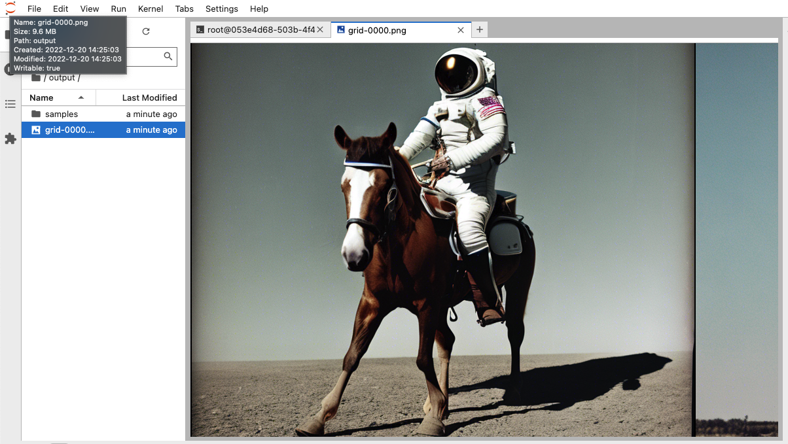

# Stable Diffusion Version 2 - trainML Instructions

This repository is a fork of [Stability-AI's Stable Diffusion Version 2](https://github.com/Stability-AI/stablediffusion) repository that contains instructions on how to run the code on the [trainML platform](https://www.trainml.ai/).

### Prerequisites

Before beginning this example, ensure that you have satisfied the following prerequisites.

- A valid [trainML account](https://auth.trainml.ai/login?response_type=code&client_id=536hafr05s8qj3ihgf707on4aq&redirect_uri=https://app.trainml.ai/auth/callback) with a non-zero [credit balance](https://docs.trainml.ai/reference/billing-credits/).
- Local connection capability [prerequisites](https://docs.trainml.ai/reference/connection-capability/#prerequisites). _Note:_ There are additional methods to [create models](https://docs.trainml.ai/reference/models/#external-model-source) or [receive job outputs](https://docs.trainml.ai/reference/job-fields/#output-data) that do not require these prerequisites, but the instructions would need to be modified to utilize them. [Contact us](mailto:support@trainml.ai) if you need any help adapting them.
- The [trainML CLI/SDK](https://github.com/trainML/trainml-cli) installed and [configured](https://github.com/trainML/trainml-cli#authentication).

## Prepare the Model

The first step is to create a [trainML Model](https://www.trainml.ai/models/) with all the code, model weights, and checkpoints pre-downloaded. This way, the model only has to be uploaded a single time and can be reused for all subsequent jobs. Not only will this make jobs start much faster, but there are no [compute charges](https://docs.trainml.ai/reference/billing-credits/#charges) for creating a model.

Start by cloning the repository:

```
git clone https://github.com/trainML/stable-diffusion-2.git
cd stable-diffusion-2
```

The trainML version of the repository has some additional packages in the requirements file and some helper scripts to make launching jobs easier.

Inside the project directory, create and activate a new [python virtual environment](https://packaging.python.org/en/latest/guides/installing-using-pip-and-virtual-environments/#creating-a-virtual-environment) inside the project, and install the required packages:

```
python3 -m venv env
source env/bin/activate
pip install -r requirements.txt
```

Next, download the CLIP model that is a dependency of the stable diffusion model. Use the `HUGGINGFACE_HUB_CACHE` environment variable to place the model file inside the project directory (instead of the default cache folder). Paste the following into the terminal in one shot:

```
HUGGINGFACE_HUB_CACHE=$(pwd) python - << EOF
import open_clip
import torch
open_clip.create_model_and_transforms("ViT-H-14", device=torch.device('cpu'), pretrained="laion2b_s32b_b79k")
EOF
```

This should create a folder called `models--laion--CLIP-ViT-H-14-laion2B-s32B-b79K` in the root of the project directory.

Next, download the specific checkpoints you need for the application you plan to use in later steps. Create the folders to store the checkpoints:

```
mkdir -p checkpoints midas_models
cd checkpoints
```

The following checkpoints are available from [Stability AI's on Hugging Face](https://huggingface.co/stabilityai). Although you can create a model with all available checkpoints, we recommend to use as few as necessary for any given model to save on storage costs, upload time, and job start time.

- [v2.1](https://huggingface.co/stabilityai/stable-diffusion-2-1) - `wget https://huggingface.co/stabilityai/stable-diffusion-2-1/resolve/main/v2-1_768-ema-pruned.ckpt`
- [v2.1 Base](https://huggingface.co/stabilityai/stable-diffusion-2-1-base) - `wget https://huggingface.co/stabilityai/stable-diffusion-2-1-base/resolve/main/v2-1_512-ema-pruned.ckpt`
- [v2.0](https://huggingface.co/stabilityai/stable-diffusion-2) - `wget https://huggingface.co/stabilityai/stable-diffusion-2/resolve/main/768-v-ema.ckpt`
- [v2.0 Base](https://huggingface.co/stabilityai/stable-diffusion-2-base) - `wget https://huggingface.co/stabilityai/stable-diffusion-2-base/resolve/main/512-base-ema.ckpt`
- [Depth](https://huggingface.co/stabilityai/stable-diffusion-2-depth) - `wget https://huggingface.co/stabilityai/stable-diffusion-2-depth/resolve/main/512-depth-ema.ckpt`
- [Upscaling](https://huggingface.co/stabilityai/stable-diffusion-x4-upscaler) - `wget https://huggingface.co/stabilityai/stable-diffusion-x4-upscaler/resolve/main/x4-upscaler-ema.ckpt`
- [Inpainting](https://huggingface.co/stabilityai/stable-diffusion-2-inpainting) - `wget https://huggingface.co/stabilityai/stable-diffusion-2-inpainting/resolve/main/512-inpainting-ema.ckpt`

If using the `Depth` model, pre-download the MiDaS model as well:

```
cd ../midas_models
wget https://github.com/intel-isl/DPT/releases/download/1_0/dpt_hybrid-midas-501f0c75.pt
```

> All the code examples assume you are using the `v2-1_768-ema-pruned` checkpoint. This is the only checkpoint you need to complete the [Notebook](#interactive-prompts-with-notebooks) and [Inference Job](#serverless-prompts-with-inference-jobs) sections. If you want to deploy the [image modification endpoints](#image-modification-endpoints), you will need their association checkpoints as well (`512-depth-ema.ckpt`,`x4-upscaler-ema.ckpt`, and/or `512-inpainting-ema.ckpt`)

Once the weights are downloaded, create a trainML model using the following command from the root directory of the project:

```
cd ..
trainml model create "stable-diffusion-2" $(pwd)
```

> You can change the name of the model, but if you do, you will need to update the job creation commands with the new model name.

You will see console output indicating the progress of the model upload. The total duration will depend on the upload speed of your internet connection. Depending on how many checkpoints you downloaded, the model will be anywhere from 9 - 28 GB. Once the model upload is complete, the console will return. You can also view the model on the [trainML Models Dashboard](https://app.trainml.ai/models).

## Interactive Prompts with Notebooks

Once the model is ready, you can create a [trainml Notebook](https://www.trainml.ai/notebooks/) from the [Notebook Dashboard](https://app.trainml.ai/jobs/notebook) or using the [trainML CLI](https://github.com/trainML/trainml-cli/blob/master/README.md#command-line-interface). The key settings to select are the following:

- GPU: RTX 3090
- Disk Size: 30GB or greater
- Model Source Type: trainML, Model: "stable-diffusion-2"
- Add the environment variable `HUGGINGFACE_HUB_CACHE` with the value `/opt/trainml/models`

To create the notebook with these settings from the CLI with a single command, enter the following:

```
trainml job create notebook "Stable Diffusion 2" \
--model-id $(trainml model list | grep stable-diffusion-2 | awk '{print $1}') \
--disk-size 30 \
--gpu-type rtx3090 \
--env HUGGINGFACE_HUB_CACHE=/opt/trainml/models
```

> The `$(trainml model list | grep stable-diffusion-2 | awk '{print $1}')` part of the command simply returns the model ID of the model named `stable-diffusion-2`. If you already know the model ID of your model, you can substitute that ID directly in to the command.

After a few minutes, the notebook window should open in your browser. If you created the notebook from the Notebook Dashboard, click the `Open` button once the notebook changes status to `running`.



Once the [JupyterLab environment](https://jupyterlab.readthedocs.io/en/stable/) opens, you can inspect the `models` folder in the file browser to verify that the model copied successfully or open a terminal window to begin running scripts.



> The following sections assume that your model was created with the [v2.1](https://huggingface.co/stabilityai/stable-diffusion-2-1) checkpoint. Ensure that the file named `v2-1_768-ema-pruned.ckpt` is inside the `checkpoints` directory before proceeding. If you use a different checkpoint file, you will need to manually update the checkpoint and config paths in the examples.

### Text-to-Image Prompts

To generate a new image, enter the following command into the terminal window of the notebook.

```
python scripts/txt2img.py \
--ckpt $TRAINML_MODEL_PATH/checkpoints/v2-1_768-ema-pruned.ckpt \
--config $TRAINML_MODEL_PATH/configs/stable-diffusion/v2-inference-v.yaml  \
--outdir $TRAINML_OUTPUT_PATH \
--H 768 --W 768 \
--n_iter 5 --n_samples 5 \
--prompt "a professional photograph of an astronaut riding a horse"
```
Modify the `prompt` to achieve the desired image results.



Each new prompt will create a new grid file in the `output` folder and new images in the `samples` subfolder and will not overwrite previous files. The total number of images generated per command is `n_iter` multiplied by `n_samples`. `n_iter` determines how many times sampling runs for each prompt and `n_samples` is how many images to pull from each iteration. In the resulting grid file, each iteration is a row, and each sample from each iteration is a column.

> `n_samples` is also the batch size, increasing this number above 6 can cause `CUDA out of memory` errors on an RTX 3090.



For additional options when running the command type `python scripts/txt2img.py --help`.

### Image-to-Image Upscaling

To modify an image, first upload the desired source image to the Notebook by using the [upload button](https://youtu.be/1bd2QHqQSH4). Then run the following command into the terminal window, replacing the `prompt` and `init-img` arguments with your desired inputs.

<pre><code>python $TRAINML_MODEL_PATH/scripts/img2img.py \
--config $TRAINML_MODEL_PATH/configs/stable-diffusion/v2-inference-v.yaml \
--ckpt $TRAINML_MODEL_PATH/checkpoints/v2-1_768-ema-pruned.ckpt \
--outdir $TRAINML_OUTPUT_PATH \
--prompt <b>"description of image you want"</b> \
--init-img <b>/path/to/image.jpg</b> \
--n_iter 5 --n_samples 5
</code></pre>

To use the example image provided with the repository, run:

```
python $TRAINML_MODEL_PATH/scripts/img2img.py \
--config $TRAINML_MODEL_PATH/configs/stable-diffusion/v2-inference-v.yaml \
--ckpt $TRAINML_MODEL_PATH/checkpoints/v2-1_768-ema-pruned.ckpt \
--outdir $TRAINML_OUTPUT_PATH \
--prompt "A photorealistic fantasy landscape" \
--init-img $TRAINML_MODEL_PATH/assets/stable-samples/img2img/sketch-mountains-input.jpg \
--n_iter 5 --n_samples 5
```

Go to the `/opt/trainml/output` folder in the notebook to see the results.

## Serverless Prompts with Inference Jobs

Notebook Jobs are the easiest way to get started or do minor experimentation. However, they are inadequate for large scale generation or automation. [Inference Jobs](https://www.trainml.ai/inference/) enable you to run multiple generations or transformations in parallel without having to keep track of starting or stopping instances. Inference jobs can be launched from the [Inference Job Dashboard](https://app.trainml.ai/jobs/inference), using the [Python SDK](https://github.com/trainML/trainml-cli/blob/master/examples/training_inference_pipeline.py), or from the [trainML CLI](https://github.com/trainML/trainml-cli#command-line-interface). They automatically download any specified input data, load the model, install requirements, execute the inference code, upload the results, and stop when finished.

### Text-To-Image

To run the same text-to-image prompt as in the notebook example as an inference job, use the following command:

```
trainml job create inference "Stable Diffusion 2 - Inference" \
--model-id $(trainml model list | grep stable-diffusion-2 | awk '{print $1}') \
--disk-size 30 \
--gpu-type rtx3090 \
--env HUGGINGFACE_HUB_CACHE=/opt/trainml/models \
--output-dir $(pwd)/outputs \
'python scripts/txt2img.py --prompt "a professional photograph of an astronaut riding a horse" --ckpt $TRAINML_MODEL_PATH/checkpoints/v2-1_768-ema-pruned.ckpt --config $TRAINML_MODEL_PATH/configs/stable-diffusion/v2-inference-v.yaml --H 768 --W 768 --outdir $TRAINML_OUTPUT_PATH --n_iter 5 --n_samples 2'
```

By default, the cli automatically attaches to the job and streams the job's log output. After a few minutes, the job will return. The generated images will be in the `outputs` folder of the current directory in a zip file named `Stable_Diffusion_2_-_Inference.zip`. Unzip the file to see the results. Depending on the settings used for the prompt, each job should cost around $0.05-0.06.

Although the CLI or web interface are an easy way to get started with inference jobs, they are most useful when launched programmatically. To launch this same inference job from a Python script, use the following code inside of an [async function](https://docs.python.org/3/library/asyncio.html), replacing the values for `model["source_uri"]` and `data["output_uri"]` with the correct values for your application.

<pre><code>job = await trainml_client.jobs.create(
    "Stable Diffusion 2 - Inference",
    type="inference",
    gpu_types=["rtx3090"],
    gpu_count=1,
    disk_size=30,
    model=dict(
        source_type="trainml",
        source_uri=<b>"my-stable-diffusion-model-id"</b>,
    ),
    environment=dict(
        type="DEEPLEARNING_PY39",
        env=[
            dict(key="HUGGINGFACE_HUB_CACHE", value="/opt/trainml/models"),
        ],
    ),
    data=dict(
        output_type="local",
        output_uri=<b>"/path/to/upload/outputs/to"</b>,
    ),
    workers=[
        'python scripts/txt2img.py \
        --ckpt $TRAINML_MODEL_PATH/checkpoints/v2-1_768-ema-pruned.ckpt \
        --config $TRAINML_MODEL_PATH/configs/stable-diffusion/v2-inference-v.yaml  \
        --outdir $TRAINML_OUTPUT_PATH \
        --H 768 --W 768 \
        --n_iter 5 --n_samples 5 \
        --prompt "a professional photograph of an astronaut riding a horse"'
    ],
)
await job.wait_for("waiting for data/model download")
await asyncio.gather(
    job.connect(), job.attach()
)  ## this returns when the job is finished
await job.disconnect()
await job.remove()
</code></pre>

You can obtain the trainML model ID for the model you uploaded by running the command `trainml model list` and copying the first column value for the model you want.

### Image-to-Image

To run the same image-to-image prompt as in the notebook example as an inference job, use the following command:

```
trainml job create inference "Stable Diffusion 2 - Upscale Inference" \
--model-id $(trainml model list | grep stable-diffusion-2 | awk '{print $1}') \
--disk-size 30 \
--gpu-type rtx3090 \
--env HUGGINGFACE_HUB_CACHE=/opt/trainml/models \
--input-dir $(pwd)/assets/stable-samples/img2img \
--output-dir $(pwd)/outputs \
'python $TRAINML_MODEL_PATH/scripts/img2img.py  --config $TRAINML_MODEL_PATH/configs/stable-diffusion/v2-inference-v.yaml --ckpt $TRAINML_MODEL_PATH/checkpoints/v2-1_768-ema-pruned.ckpt --outdir $TRAINML_OUTPUT_PATH --prompt "A photorealistic fantasy landscape" --init-img $TRAINML_INPUT_PATH/sketch-mountains-input.jpg --n_iter 5 --n_samples 5'
```

By default, the cli automatically attaches to the job and streams the job's log output. After a few minutes, the job will return. The generated images will be in the `outputs` folder of the current directory in a zip file named `Stable_Diffusion_2_-_Upscale_Inference.zip`. Unzip the file to see the results. Depending on the settings used for the prompt, each job should cost around $0.07-0.08.

Similar to the text-to-image example, this can also be launched from a Python script:

<pre><code>job = await trainml_client.jobs.create(
    "Stable Diffusion 2 - Inference",
    type="inference",
    gpu_types=["rtx3090"],
    gpu_count=1,
    disk_size=30,
    model=dict(
        source_type="trainml",
        source_uri=<b>"my-stable-diffusion-model-id"</b>,
    ),
    environment=dict(
        type="DEEPLEARNING_PY39",
        env=[
            dict(key="HUGGINGFACE_HUB_CACHE", value="/opt/trainml/models"),
        ],
    ),
    data=dict(
        input_type="local",
        input_uri=<b>"/path/to/input/image/directory"</b>,
        output_type="local",
        output_uri=<b>"/path/to/upload/outputs/to"</b>,
    ),
    workers=[
        'python $TRAINML_MODEL_PATH/scripts/img2img.py \
        --config $TRAINML_MODEL_PATH/configs/stable-diffusion/v2-inference-v.yaml \
        --ckpt $TRAINML_MODEL_PATH/checkpoints/v2-1_768-ema-pruned.ckpt \
        --outdir $TRAINML_OUTPUT_PATH \
        --prompt "A photorealistic fantasy landscape" \
        --init-img $TRAINML_INPUT_PATH/<b>name-of-input-image.jpg</b>  \
        --n_iter 5 --n_samples 5'
    ],
)
await job.wait_for("waiting for data/model download")
await asyncio.gather(
    job.connect(), job.attach()
)  ## this returns when the job is finished
await job.disconnect()
await job.remove()
</code></pre>

This case, replacing the values for `model["source_uri"]`, `data["output_uri"]`, `data["input_uri"]`, `--init-img` in the worker command with the appropriate values.

> Ensure that `input_uri` is a directory, not a file. Although other supported [storage sources](https://docs.trainml.ai/reference/job-fields/#input-data) support loading individual files, the `local` storage driver only works on directories.

## Image Modification Endpoints

The Stable Diffusion 2 repository also provides 3 specialized image-to-image checkpoints with associated web demos. To launch the web demos on the trainML platform, use the `create_endpoint.py` python script added to the [trainML version of the repository](https://github.com/trainML/stable-diffusion-2.git).

> The script assumes that the specialized weights were downloaded into the trainML model before creation. For example, to launch the `upscaling` endpoint, the [Upscaling](https://huggingface.co/stabilityai/stable-diffusion-x4-upscaler) checkpoint (`x4-upscaler-ema.ckpt`) must be loaded into the `checkpoints` folder of the model during [model preparation](#prepare-the-model)

The syntax for the command is the following:

```
python create_endpoint.py MODEL_ID \
--server-type [streamlit, gradio] \
--model-type [depth, upscaling, inpainting]
```

- `MODEL_ID` is the ID of the trainML model with the code repository and pre-downloaded checkpoints. You can find this by using the `trainml model list` command.
- `server-type` is the web server implementation to use. The Stable Diffusion 2 repository implemented all the servers in [gradio](https://www.gradio.app) and [streamlit](https://streamlit.io)
- `model-type` is the type of image modification demo to launch

For example, to launch the `streamlit` version of the image upscaler on the model created in the original step (assuming the `x4-upscaler-ema.ckpt` checkpoint was downloaded), run the following:

```
python create_endpoint.py $(trainml model list | grep stable-diffusion-2 | awk '{print $1}') \
--server-type streamlit \
--model-type upscaling
```

The script will automatically create the endpoint and open a web browser to the endpoint when it is ready. You can also find the link to the endpoint from the [Endpoint Dashboard](https://app.trainml.ai/jobs/endpoint) by clicking the `Connect` button. The URL is only available when the endpoint is running.

> Endpoints will run until you stop them. You are being charge computing time as long as they are running. Be sure to stop your endpoint once you are done to avoid incurring unexpected charged. **Closing the browser window does not stop the endpoint**

---

## Original Repo README.md

# Stable Diffusion Version 2


This repository contains [Stable Diffusion](https://github.com/CompVis/stable-diffusion) models trained from scratch and will be continuously updated with
new checkpoints. The following list provides an overview of all currently available models. More coming soon.

## News

**December 7, 2022**

*Version 2.1*

- New stable diffusion model (_Stable Diffusion 2.1-v_, [HuggingFace](https://huggingface.co/stabilityai/stable-diffusion-2-1)) at 768x768 resolution and (_Stable Diffusion 2.1-base_, [HuggingFace](https://huggingface.co/stabilityai/stable-diffusion-2-1-base)) at 512x512 resolution, both based on the same number of parameters and architecture as 2.0 and fine-tuned on 2.0, on a less restrictive NSFW filtering of the [LAION-5B](https://laion.ai/blog/laion-5b/) dataset.
Per default, the attention operation of the model is evaluated at full precision when `xformers` is not installed. To enable fp16 (which can cause numerical instabilities with the vanilla attention module on the v2.1 model) , run your script with `ATTN_PRECISION=fp16 python <thescript.py>`

**November 24, 2022**

*Version 2.0*

- New stable diffusion model (_Stable Diffusion 2.0-v_) at 768x768 resolution. Same number of parameters in the U-Net as 1.5, but uses [OpenCLIP-ViT/H](https://github.com/mlfoundations/open_clip) as the text encoder and is trained from scratch. _SD 2.0-v_ is a so-called [v-prediction](https://arxiv.org/abs/2202.00512) model. 
- The above model is finetuned from _SD 2.0-base_, which was trained as a standard noise-prediction model on 512x512 images and is also made available.
- Added a [x4 upscaling latent text-guided diffusion model](#image-upscaling-with-stable-diffusion).
- New [depth-guided stable diffusion model](#depth-conditional-stable-diffusion), finetuned from _SD 2.0-base_. The model is conditioned on monocular depth estimates inferred via [MiDaS](https://github.com/isl-org/MiDaS) and can be used for structure-preserving img2img and shape-conditional synthesis.

  
- A [text-guided inpainting model](#image-inpainting-with-stable-diffusion), finetuned from SD _2.0-base_.

We follow the [original repository](https://github.com/CompVis/stable-diffusion) and provide basic inference scripts to sample from the models.

________________
*The original Stable Diffusion model was created in a collaboration with [CompVis](https://arxiv.org/abs/2202.00512) and [RunwayML](https://runwayml.com/) and builds upon the work:*

[**High-Resolution Image Synthesis with Latent Diffusion Models**](https://ommer-lab.com/research/latent-diffusion-models/)<br/>
[Robin Rombach](https://github.com/rromb)\*,
[Andreas Blattmann](https://github.com/ablattmann)\*,
[Dominik Lorenz](https://github.com/qp-qp)\,
[Patrick Esser](https://github.com/pesser),
[Björn Ommer](https://hci.iwr.uni-heidelberg.de/Staff/bommer)<br/>
_[CVPR '22 Oral](https://openaccess.thecvf.com/content/CVPR2022/html/Rombach_High-Resolution_Image_Synthesis_With_Latent_Diffusion_Models_CVPR_2022_paper.html) |
[GitHub](https://github.com/CompVis/latent-diffusion) | [arXiv](https://arxiv.org/abs/2112.10752) | [Project page](https://ommer-lab.com/research/latent-diffusion-models/)_

and [many others](#shout-outs).

Stable Diffusion is a latent text-to-image diffusion model.
________________________________
  
## Requirements

You can update an existing [latent diffusion](https://github.com/CompVis/latent-diffusion) environment by running

```
conda install pytorch==1.12.1 torchvision==0.13.1 -c pytorch
pip install transformers==4.19.2 diffusers invisible-watermark
pip install -e .
``` 
#### xformers efficient attention
For more efficiency and speed on GPUs, 
we highly recommended installing the [xformers](https://github.com/facebookresearch/xformers)
library.

Tested on A100 with CUDA 11.4.
Installation needs a somewhat recent version of nvcc and gcc/g++, obtain those, e.g., via 
```commandline
export CUDA_HOME=/usr/local/cuda-11.4
conda install -c nvidia/label/cuda-11.4.0 cuda-nvcc
conda install -c conda-forge gcc
conda install -c conda-forge gxx_linux-64==9.5.0
```

Then, run the following (compiling takes up to 30 min).

```commandline
cd ..
git clone https://github.com/facebookresearch/xformers.git
cd xformers
git submodule update --init --recursive
pip install -r requirements.txt
pip install -e .
cd ../stablediffusion
```
Upon successful installation, the code will automatically default to [memory efficient attention](https://github.com/facebookresearch/xformers)
for the self- and cross-attention layers in the U-Net and autoencoder.

## General Disclaimer
Stable Diffusion models are general text-to-image diffusion models and therefore mirror biases and (mis-)conceptions that are present
in their training data. Although efforts were made to reduce the inclusion of explicit pornographic material, **we do not recommend using the provided weights for services or products without additional safety mechanisms and considerations.
The weights are research artifacts and should be treated as such.**
Details on the training procedure and data, as well as the intended use of the model can be found in the corresponding [model card](https://huggingface.co/stabilityai/stable-diffusion-2).
The weights are available via [the StabilityAI organization at Hugging Face](https://huggingface.co/StabilityAI) under the [CreativeML Open RAIL++-M License](LICENSE-MODEL). 


## Stable Diffusion v2

Stable Diffusion v2 refers to a specific configuration of the model
architecture that uses a downsampling-factor 8 autoencoder with an 865M UNet
and OpenCLIP ViT-H/14 text encoder for the diffusion model. The _SD 2-v_ model produces 768x768 px outputs. 

Evaluations with different classifier-free guidance scales (1.5, 2.0, 3.0, 4.0,
5.0, 6.0, 7.0, 8.0) and 50 DDIM sampling steps show the relative improvements of the checkpoints:


### Text-to-Image


Stable Diffusion 2 is a latent diffusion model conditioned on the penultimate text embeddings of a CLIP ViT-H/14 text encoder.
We provide a [reference script for sampling](#reference-sampling-script).
#### Reference Sampling Script

This script incorporates an [invisible watermarking](https://github.com/ShieldMnt/invisible-watermark) of the outputs, to help viewers [identify the images as machine-generated](scripts/tests/test_watermark.py).
We provide the configs for the _SD2-v_ (768px) and _SD2-base_ (512px) model.

First, download the weights for [_SD2.1-v_](https://huggingface.co/stabilityai/stable-diffusion-2-1) and [_SD2.1-base_](https://huggingface.co/stabilityai/stable-diffusion-2-1-base). 

To sample from the _SD2.1-v_ model, run the following:

```
python scripts/txt2img.py --prompt "a professional photograph of an astronaut riding a horse" --ckpt <path/to/768model.ckpt/> --config configs/stable-diffusion/v2-inference-v.yaml --H 768 --W 768  
```
or try out the Web Demo: [](https://huggingface.co/spaces/stabilityai/stable-diffusion).

To sample from the base model, use
```
python scripts/txt2img.py --prompt "a professional photograph of an astronaut riding a horse" --ckpt <path/to/model.ckpt/> --config <path/to/config.yaml/>  
```

By default, this uses the [DDIM sampler](https://arxiv.org/abs/2010.02502), and renders images of size 768x768 (which it was trained on) in 50 steps. 
Empirically, the v-models can be sampled with higher guidance scales.

Note: The inference config for all model versions is designed to be used with EMA-only checkpoints. 
For this reason `use_ema=False` is set in the configuration, otherwise the code will try to switch from
non-EMA to EMA weights. 

### Image Modification with Stable Diffusion


#### Depth-Conditional Stable Diffusion

To augment the well-established [img2img](https://github.com/CompVis/stable-diffusion#image-modification-with-stable-diffusion) functionality of Stable Diffusion, we provide a _shape-preserving_ stable diffusion model.


Note that the original method for image modification introduces significant semantic changes w.r.t. the initial image.
If that is not desired, download our [depth-conditional stable diffusion](https://huggingface.co/stabilityai/stable-diffusion-2-depth) model and the `dpt_hybrid` MiDaS [model weights](https://github.com/intel-isl/DPT/releases/download/1_0/dpt_hybrid-midas-501f0c75.pt), place the latter in a folder `midas_models` and sample via 
```
python scripts/gradio/depth2img.py configs/stable-diffusion/v2-midas-inference.yaml <path-to-ckpt>
```

or

```
streamlit run scripts/streamlit/depth2img.py configs/stable-diffusion/v2-midas-inference.yaml <path-to-ckpt>
```

This method can be used on the samples of the base model itself.
For example, take [this sample](assets/stable-samples/depth2img/old_man.png) generated by an anonymous discord user.
Using the [gradio](https://gradio.app) or [streamlit](https://streamlit.io/) script `depth2img.py`, the MiDaS model first infers a monocular depth estimate given this input, 
and the diffusion model is then conditioned on the (relative) depth output.

<p align="center">
<b> depth2image </b><br/>

</p>

This model is particularly useful for a photorealistic style; see the [examples](assets/stable-samples/depth2img).
For a maximum strength of 1.0, the model removes all pixel-based information and only relies on the text prompt and the inferred monocular depth estimate.


#### Classic Img2Img

For running the "classic" img2img, use
```
python scripts/img2img.py --prompt "A fantasy landscape, trending on artstation" --init-img <path-to-img.jpg> --strength 0.8 --ckpt <path/to/model.ckpt>
```
and adapt the checkpoint and config paths accordingly.

### Image Upscaling with Stable Diffusion

After [downloading the weights](https://huggingface.co/stabilityai/stable-diffusion-x4-upscaler), run
```
python scripts/gradio/superresolution.py configs/stable-diffusion/x4-upscaling.yaml <path-to-checkpoint>
```

or

```
streamlit run scripts/streamlit/superresolution.py -- configs/stable-diffusion/x4-upscaling.yaml <path-to-checkpoint>
```

for a Gradio or Streamlit demo of the text-guided x4 superresolution model.  
This model can be used both on real inputs and on synthesized examples. For the latter, we recommend setting a higher 
`noise_level`, e.g. `noise_level=100`.

### Image Inpainting with Stable Diffusion


[Download the SD 2.0-inpainting checkpoint](https://huggingface.co/stabilityai/stable-diffusion-2-inpainting) and run

```
python scripts/gradio/inpainting.py configs/stable-diffusion/v2-inpainting-inference.yaml <path-to-checkpoint>
```

or

```
streamlit run scripts/streamlit/inpainting.py -- configs/stable-diffusion/v2-inpainting-inference.yaml <path-to-checkpoint>
```

for a Gradio or Streamlit demo of the inpainting model. 
This scripts adds invisible watermarking to the demo in the [RunwayML](https://github.com/runwayml/stable-diffusion/blob/main/scripts/inpaint_st.py) repository, but both should work interchangeably with the checkpoints/configs.  


## Shout-Outs
- Thanks to [Hugging Face](https://huggingface.co/) and in particular [Apolinário](https://github.com/apolinario)  for support with our model releases!
- Stable Diffusion would not be possible without [LAION](https://laion.ai/) and their efforts to create open, large-scale datasets.
- The [DeepFloyd team](https://twitter.com/deepfloydai) at Stability AI, for creating the subset of [LAION-5B](https://laion.ai/blog/laion-5b/) dataset used to train the model.
- Stable Diffusion 2.0 uses [OpenCLIP](https://laion.ai/blog/large-openclip/), trained by [Romain Beaumont](https://github.com/rom1504).  
- Our codebase for the diffusion models builds heavily on [OpenAI's ADM codebase](https://github.com/openai/guided-diffusion)
and [https://github.com/lucidrains/denoising-diffusion-pytorch](https://github.com/lucidrains/denoising-diffusion-pytorch). 
Thanks for open-sourcing!
- [CompVis](https://github.com/CompVis/stable-diffusion) initial stable diffusion release
- [Patrick](https://github.com/pesser)'s [implementation](https://github.com/runwayml/stable-diffusion/blob/main/scripts/inpaint_st.py) of the streamlit demo for inpainting.
- `img2img` is an application of [SDEdit](https://arxiv.org/abs/2108.01073) by [Chenlin Meng](https://cs.stanford.edu/~chenlin/) from the [Stanford AI Lab](https://cs.stanford.edu/~ermon/website/). 
- [Kat's implementation]((https://github.com/CompVis/latent-diffusion/pull/51)) of the [PLMS](https://arxiv.org/abs/2202.09778) sampler, and [more](https://github.com/crowsonkb/k-diffusion).
- [DPMSolver](https://arxiv.org/abs/2206.00927) [integration](https://github.com/CompVis/stable-diffusion/pull/440) by [Cheng Lu](https://github.com/LuChengTHU).
- Facebook's [xformers](https://github.com/facebookresearch/xformers) for efficient attention computation.
- [MiDaS](https://github.com/isl-org/MiDaS) for monocular depth estimation.


## License

The code in this repository is released under the MIT License.

The weights are available via [the StabilityAI organization at Hugging Face](https://huggingface.co/StabilityAI), and released under the [CreativeML Open RAIL++-M License](LICENSE-MODEL) License.

## BibTeX

```
@misc{rombach2021highresolution,
      title={High-Resolution Image Synthesis with Latent Diffusion Models}, 
      author={Robin Rombach and Andreas Blattmann and Dominik Lorenz and Patrick Esser and Björn Ommer},
      year={2021},
      eprint={2112.10752},
      archivePrefix={arXiv},
      primaryClass={cs.CV}
}
```


